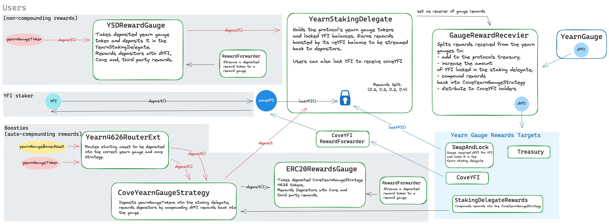

# smart-contracts-core


<div align="center">

[](https://codecov.io/gh/Storm-Labs-Inc/smart-contracts-core)
[](https://github.com/Storm-Labs-Inc/smart-contracts-core/actions/workflows/ci.yml)
[](https://discord.gg/xdhvEFVsE9)
[](https://twitter.com/intent/user?screen_name=cove_fi)

</div>

This repository contains the core smart contracts for the Cove Protocol. It includes Boosties (a liquid locker and
staking platform for Yearn), a governance token, and auxiliary contracts.

The testing suite includes unit, integration, fork, and invariant tests.

For detailed documentation, visit the [GitBook](https://docs.cove.finance/).

## Architecture



## Prerequisites

Ensure you have the following installed:

- [Node.js](https://nodejs.org/) (v18.16.1)
- [Python](https://www.python.org/) (v3.9.17)
- [Rust](https://www.rust-lang.org/) (v1.75.0)

## Installation

Install [rust using rustup](https://rustup.rs/):

```sh
rustup update
```

Install the python dependencies:

```sh
pip install -r requirements.txt
```

Install the forge libraries as submodules:

```sh
forge install
```

Install node and build dependencies:

```sh
pnpm install
```

## Usage

Build forge-deploy if not already built:

```sh
pnpm forge-deploy:build
```

Build the contracts:

```sh
pnpm build
```

Run the tests:

```sh
pnpm test
```

### Run invariant tests (echidna)

[Install echidna](https://github.com/crytic/echidna?tab=readme-ov-file#installation) and run the test for each Echidna
test contract:

> Echidna may fail if the contracts are not built cleanly. If you encounter issues, try running
> `pnpm clean && pnpm build` before running the tests.

```sh
pnpm invariant-test ERC20RewardsGauge_EchidnaTest
```

### Run slither static analysis

[Install slither](https://github.com/crytic/slither?tab=readme-ov-file#how-to-install) and run the tool:

```sh
pnpm slither
```

To run the [upgradeability checks](https://github.com/crytic/slither/wiki/Upgradeability-Checks) with
`slither-check-upgradeability`:

```sh
pnpm slither-upgradeability
```

### Run semgrep static analysis

[Install semgrep](https://github.com/semgrep/semgrep?tab=readme-ov-file#option-2-getting-started-from-the-cli) and run
the tool:

```sh
pnpm semgrep
```

## Deploying contracts to a live network

### Local mainnet fork

Fork mainnet on the local network using anvil with the provided script:

```sh
pnpm fork:mainnet
```

Keep this terminal session going to keep the fork network alive.

Then in another terminal session, deploy the contracts to the local network:

```sh
pnpm deploy:local
```

- Deployments will be in `deployments/<chainId>-fork`.
- Make sure to not commit `broadcast/`.
- If trying to deploy new contract either use the default deployer functions or generate them
  with`$./forge-deploy gen-deployer`.

## Audits

Smart contract audits of the Cove Protocol are available [here](https://github.com/Storm-Labs-Inc/cove-audits).
